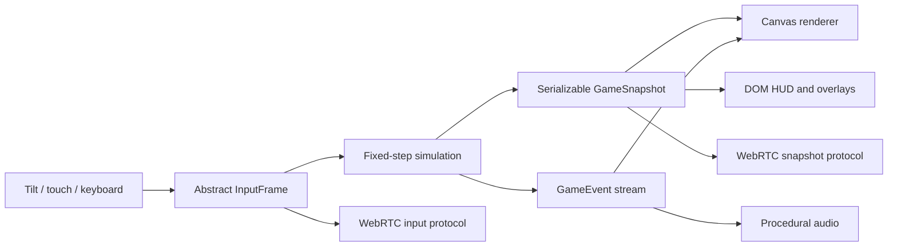

# Technical architecture

## Architectural objective

Combat rules, rendering, input devices, interface, and networking must remain replaceable. Historical fighting kits are data-heavy; coupling them to animation callbacks or a particular renderer would make every new master expensive and brittle.

The vertical slice uses a deterministic TypeScript simulation and a disposable Canvas 2D view. The compiled output is plain ES modules hosted from `site/`.



## Runtime boundaries

### Simulation: `src/sim/`

Owns:

- Actors and serializable state
- Fixed-step movement
- Attack definitions and combo routing
- Soft targeting and alignment
- Hit/guard/armor resolution
- Parry and interception windows
- Enemy decisions and attack permissions
- Wave spawning and progression
- Lessons and random seed
- Score, victory, and defeat

The simulation does not import the renderer, DOM, device sensors, audio, or WebRTC.

### Application controller: `src/app/`

Owns:

- Mode transitions: title, solo, host, guest
- Fixed-step accumulation
- Connecting sampled input to simulation steps
- Dispatching snapshots and events to adapters
- Pause/restart flow
- Host snapshot cadence and guest input cadence

The simulation step is 60 Hz. Rendering follows the browser refresh rate. Edge-triggered inputs are retained until at least one fixed simulation step consumes them, which matters on 90/120 Hz displays.

### Input: `src/input/`

All physical controls map to one `InputFrame`:

```ts
interface InputFrame {
  moveX: number;
  moveZ: number;
  lightPressed: boolean;
  heavyPressed: boolean;
  mobilityPressed: boolean;
  switchPressed: boolean;
  guardHeld: boolean;
  guardPressed: boolean;
}
```

Tilt, virtual stick, keyboard, and future gamepad code therefore do not alter combat logic.

Tilt processing includes:

- Explicit permission request where required
- Neutral-position calibration/recenter
- Landscape-axis mapping
- Dead zone
- Smoothing
- Normalized two-axis output

### Renderer: `src/render/`

The current Canvas renderer owns:

- Arena projection from logical X/Z coordinates
- Depth ordering
- Procedural figures and weapons
- Attack arcs, shadows, particles, floating text, and screen feedback
- Courtyard-to-manuscript corruption transition
- Optional debug display

It does not decide hits, damage, timing, AI, or progression.

### DOM interface: `src/ui/` and `site/index.html`

Owns:

- Title and controls primer
- Player, wave, doctrine, score, and boss HUD
- Touch controls
- Lesson cards
- Pause and results overlays
- Manual co-op pairing flow
- Rotate-device messaging

Text-heavy or accessibility-sensitive UI remains outside the canvas.

### Audio: `src/audio/`

The slice synthesizes simple cues through Web Audio to avoid external files. Production audio should remain event-driven and preserve cue categories for attack, impact, block, parry, armor, guard break, boss phase, victory, and defeat.

### Networking: `src/network/`

Owns:

- Peer-connection setup
- Manual offer/answer token encoding
- Unreliable/realtime and reliable/event message semantics
- Input, snapshot, upgrade, restart, and liveness messages

Detailed production changes are in [NETWORKING.md](NETWORKING.md).

## Source-of-truth rules

- Simulation state is authoritative.
- Render objects are disposable views.
- DOM labels are derived from snapshots/events.
- Save data contains serializable content IDs and simulation values, never canvas objects or browser event instances.
- Asset filenames should eventually be hidden behind a stable manifest.
- Move IDs are stable content keys; display names may change after historical review.

## Combat data model

Each attack defines:

- Startup, active, and recovery durations
- Damage and guard damage
- Forward reach, depth, and rear allowance
- Movement during the action
- Knockback, hit-stun, and hit-stop
- Maximum targets and front/radial geometry
- Heavy/provoking flags
- Interception interval
- Signature label
- Permitted light/heavy/switch continuations
- Parryability and shockwave behavior where relevant

This model supports frame-oriented balancing without tying rules to sprite frame indices. A production animation clip references attack event markers through content data, and validation tests ensure markers remain within the attack timeline.

## Fixed-step loop

```text
render frame begins
  sample all physical inputs
  merge edge presses into pending input
  add elapsed time to accumulator
  while accumulator >= 1/60:
    consume pending edges on first step
    strip edges on any catch-up steps
    advance authoritative simulation
    emit and consume game events
  render latest snapshot
  update DOM HUD
render frame ends
```

A maximum render delta prevents a suspended tab from generating an uncontrolled catch-up burst.

## Network authority

Host-authoritative mode uses the same simulation as solo play:

- Host simulates both players, enemies, hits, random state, waves, and lessons.
- Guest sends input frames.
- Host sends serializable snapshots approximately 20 times per second.
- Guest renders the latest host snapshot.

The slice intentionally omits full local prediction/reconciliation. Production co-op must add predicted local movement, interpolation of remote actors, timestamped defensive actions, and bounded host rewind for parries/dodges.

## Persistence boundary

Current slice: service-worker cache only; run state is not persisted.

Production save model:

```ts
interface ProfileSave {
  schemaVersion: number;
  unlockedMasters: string[];
  unlockedLessons: string[];
  cosmetics: string[];
  challengeRecords: Record<string, number>;
  codexEntries: string[];
  settings: PlayerSettings;
}
```

Use schema migrations and local-first storage. Account/cloud synchronization is a separate optional service and should not block offline play.

## Asset pipeline target

The slice uses procedural shapes. Production 2D characters should follow a repeatable pipeline:

1. Approve one in-game seed pose and silhouette.
2. Author/generate a complete animation strip together to limit drift.
3. Normalize all frames to one bottom-center anchor and shared scale.
4. Export an animation manifest with frame timing and combat markers.
5. Review at actual phone scale in motion.
6. Compress atlases and audio; establish device memory budgets.
7. Run visual regression screenshots for every kit and orientation.

Suggested asset domains:

```text
assets/
  characters/<master>/<kit>/
  enemies/<tier>/<archetype>/
  environments/<act>/
  fx/
  audio/
  ui/
  codex/
  manifests/
```

## Canvas renderer versus Phaser

The current Canvas adapter is appropriate for a dependency-free graybox. Production can proceed in either direction.

### Retain Canvas when

- The visual language remains stylized and low-asset
- Custom kinematic combat is the dominant complexity
- The team values a very small runtime and direct rendering control

### Add a Phaser renderer when

- Sprite-atlas animation, cameras, particles, scene tooling, and asset loading become the dominant production burden
- The art team needs a mature 2D integration path
- The project benefits from established browser-game tooling

A Phaser migration should add a new view adapter rather than move simulation logic into scene callbacks. Keep the DOM HUD and abstract input mapping.

## Performance budgets

Initial mobile targets:

- 60 simulation steps per second
- 60 rendered frames per second on representative mid-range devices; provide a 30 fps rendering fallback without changing simulation rate
- Maximum 10–14 ordinary enemies plus two players in a typical arena before profiling justifies expansion
- No per-frame allocation in critical collision/AI loops after optimization pass
- Bounded particles and floating labels
- Atlas and audio budgets set per act before production art begins
- No forced high-resolution canvas beyond useful device pixel density

Measure on physical phones. Desktop results are insufficient for thermal throttling, touch latency, sensor noise, Safari behavior, or memory pressure.

## Testing strategy

### Automated

- Combo resolution
- Lesson transformations
- Target selection
- Wave progression
- Snapshot serialization
- Determinism by seed and input log
- Hit/guard/parry timing boundaries
- Content-schema validation
- Network protocol compatibility

### Browser automation

- Boot to first actionable screen
- Start and restart flows
- DOM overlay visibility
- Resize/orientation states
- Touch pointer lifecycle
- Screenshot review of title, combat, lesson, boss, and result states

### Physical-device

- iOS Safari and installed PWA
- Android Chrome and installed PWA
- 60/90/120 Hz input retention
- Tilt calibration and recenter
- Safe areas/notches
- Background/resume
- Thermal and battery behavior
- Two-phone Wi-Fi/hotspot sessions

## Production repository split

Keep one repository until deployment or team boundaries justify separation:

```text
apps/game-web/              Browser/PWA client
packages/simulation/        Deterministic rules and content schemas
packages/content/           Master, enemy, lesson, and encounter data
packages/protocol/          Versioned network messages
services/signaling/         Small room-code/QR signaling service
research/                   Source notes and provenance metadata
art-source/                 Restricted working files, if licensing permits
```

The current single-package layout is intentionally simpler but already follows these boundaries internally.
