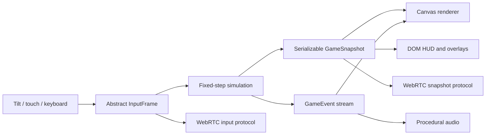

# Technical architecture

## Architectural objective

Combat rules, rendering, input devices, interface, and networking must remain replaceable. Historical fighting kits are data-heavy; coupling them to animation callbacks or a particular renderer would make every new master expensive and brittle.

The vertical slice uses a deterministic TypeScript simulation and a disposable Canvas 2D view. The compiled output is plain ES modules hosted from `site/`.



## Runtime boundaries

### Simulation: `src/sim/`

Owns:

- Actors and serializable state
- Fixed-step movement
- Attack definitions and combo routing
- Soft targeting and alignment
- Hit/guard/armor resolution
- Parry and interception windows
- Enemy decisions and attack permissions
- Wave spawning and progression
- Lessons and random seed
- Score, victory, and defeat

The simulation does not import the renderer, DOM, device sensors, audio, or WebRTC.

### Application controller: `src/app/`

Owns:

- Mode transitions: title, solo, host, guest
- Fixed-step accumulation
- Connecting sampled input to simulation steps
- Dispatching snapshots and events to adapters
- Pause/restart flow
- Host snapshot cadence and guest input cadence

The simulation step is 60 Hz. Rendering follows the browser refresh rate. Edge-triggered inputs are retained until at least one fixed simulation step consumes them, which matters on 90/120 Hz displays.

### Input: `src/input/`

All physical controls map to one `InputFrame`:

```ts
interface InputFrame {
  moveX: number;
  moveZ: number;
  lightPressed: boolean;
  heavyPressed: boolean;
  mobilityPressed: boolean;
  switchPressed: boolean;
  guardHeld: boolean;
  guardPressed: boolean;
}
```

Tilt, virtual stick, keyboard, and future gamepad code therefore do not alter combat logic.

Tilt processing includes:

- Explicit permission request where required
- Neutral-position calibration/recenter
- Landscape-axis mapping
- Dead zone
- Smoothing
- Normalized two-axis output

### Renderer: `src/render/`

The current Canvas renderer owns:

- Arena projection from logical X/Z coordinates
- Depth ordering
- Procedural figures and weapons
- Attack arcs, shadows, particles, floating text, and screen feedback
- Overhead life bars for every living fighter (`BAR_LIFT`, verified above each archetype's authored display height in `tests/overhead-bars.test.mjs`), with armour as a second track
- Courtyard-to-manuscript corruption transition
- Optional debug display

It does not decide hits, damage, timing, AI, or progression.

### DOM interface: `src/ui/` and `site/index.html`

Owns:

- Title and controls primer
- Player, wave, doctrine, score, and boss HUD
- Touch controls
- Lesson cards
- Pause and results overlays
- Manual co-op pairing flow
- Rotate-device messaging

Text-heavy or accessibility-sensitive UI remains outside the canvas.

### Audio: `src/audio/`

The slice synthesizes simple cues through Web Audio to avoid external files. Production audio should remain event-driven and preserve cue categories for attack, impact, block, parry, armor, guard break, boss phase, victory, and defeat.

### Networking: `src/network/`

Owns:

- Peer-connection setup
- Manual offer/answer token encoding
- Unreliable/realtime and reliable/event message semantics
- Input, snapshot, upgrade, restart, and liveness messages

Detailed production changes are in [NETWORKING.md](NETWORKING.md).

## Source-of-truth rules

- Simulation state is authoritative.
- Render objects are disposable views.
- DOM labels are derived from snapshots/events.
- Save data contains serializable content IDs and simulation values, never canvas objects or browser event instances.
- Asset filenames should eventually be hidden behind a stable manifest.
- Move IDs are stable content keys; display names may change after historical review.

## Combat data model

Each attack defines:

- Startup, active, and recovery durations
- Damage and guard damage
- Forward reach, depth, and rear allowance
- Movement during the action
- Knockback, hit-stun, and hit-stop
- Maximum targets and front/radial geometry
- Heavy/provoking flags
- Interception interval
- Signature label
- Permitted light/heavy/switch continuations
- Parryability and shockwave behavior where relevant

This model supports frame-oriented balancing without tying rules to sprite frame indices. A production animation clip references attack event markers through content data, and validation tests ensure markers remain within the attack timeline.

### Chain links

A string is paced by startups, not by recovery tails. A light attack that actually connects cancels the rest of its recovery into the next buffered chain move, so the gap between two contacts is the next cut's startup plus the previous cut's remaining active frames. A whiffed or blocked cut pays its full recovery, and a heavy never cancels, which keeps the committed strike a decision rather than the fastest button.

Because of that, chained frame data is a contract: a link only lands while the hitstun the previous cut applied is still running. Every declared `nextLight` route therefore satisfies

```text
hitstun(previous) * decay(position) >= active(previous) + startup(next) + one frame
```

Hitstun decays across a string as well, and a lull longer than any possible link starts a fresh string. That is what keeps long chains from becoming infinite juggles: a string starves itself out and the defender always gets a turn. `tests/combo-links.test.mjs` asserts both halves — the frame-data inequality for every authored link, and a live simulation of a mashed chain against a pinned dummy.

### Field items

A level arms the fight. Anything a fallen enemy was holding lands where they fell, and the road marks what a hand can close on; Switch takes it. There is no inventory to manage, which is how Little Fighter 2 arms a level, but nothing here is collected by pacing over it — a take is a deliberate press.

- **The drop table is per-archetype** (`DROP_TABLE` in `src/sim/world.ts`): a thug leaves his cudgel, a spearman his shaft, a captain steel worth fencing with, and a wretch nothing but the chance of a draught.
- **Taking is an offer, not a trigger.** `itemWithinReach(actor, item)` is the whole rule — on the ground, inside `ITEM_PICKUP_RADIUS + radius`, and acceptable to `canTakeItem` — and it is exported, so the renderer's gold ring and caret and the HUD's `TAKE CUDGEL` line are computed from the very predicate `reachForItem` accepts with. The cue can never promise a take the hands would refuse, and there is no code path where walking over a cudgel arms anyone (pinned by `tests/item-intent.test.mjs`, which drives a matrix of hands × items × distances and asserts the cue and the press agree on every one). Two consequences fall out of that: the enemies never loot, so the road is the player's to strip, and the press is per-fighter, so in co-op each player takes only what they reach for.
- **The reach is a stance, not a state flag.** `ITEM_REACH_STATES` (idle, move, crouch, block, switch, jump) is checked once at the top of `updatePlayer` before any other branch claims the press, so a hand mid-cut cannot also close on a cudgel and a stagger buffers the press instead of swallowing it. When nothing is on offer, the press falls through to its older jobs untouched — the blade switch, or the hurl when a find is carried, which is why standing on a captain's sword with a club in hand throws the club rather than swapping.
- **A find is not a lesson kit.** `cl_*` and `sp_*` rows give Meyer a short improvised kit — two cuts, a committed overhead, and a hurl — and none of his learned longsword or dussack routes fire with a find in his hands. His own blade waits in the back slot (`stowedWeapon`) and comes back when the find is spent.
- **A find is spent twice**: one pip per *landed* blow (`chipCarriedWeapon`), and the rest of the pips ride the weapon when it is hurled. At zero pips it splits in his hands and the fencing weapon is back out.
- **Throwing is the switch button.** `startSwitch` diverts to `startThrow` whenever a find is carried, so no new input exists for touch; the throw row declares `throw: true, releaseAt`, and `updatePlayerAttack` lets go of the weapon at that frame rather than resolving a melee hitbox. A flying find bites whoever it crosses through the ordinary hit pipeline, except that a parry knocks the weapon out of the air instead of flinching the man who threw it.
- **Steel needs both hands.** A fencing drop is only taken when he is not already carrying something and does not already have that blade out — which makes "hurl the club, take the captain's sword" a decision rather than an automatic upgrade.
- **Never a permanent object.** Items fade after `ITEM_LIFETIME_SECONDS`, walking into the next level sweeps the road (its ground is its own, and only the people and their weapons cross the doorway), and nothing can be plucked out of the air (`ITEM_GRAB_HEIGHT`).

Items travel in the replica snapshot as plain data (`items`, `thrown`), so a client can tell a hurl from a drop. Guest item positions are not interpolated yet, so they snap at the snapshot rate.

## Levels, waves, and the walk out

The campaign is **levels, and levels hold waves**. A level is one place: a name, one dressing, one road (`road`, in world pixels), and the fights along it (`waves`, in order). The waves are the encounters; the level is the ground they happen on. `src/sim/waves.ts` authors that nesting and nothing else: `LEVELS` is the only campaign table, there is no flattened copy to keep in step, and no helper for re-deriving a wave's level from a running count — the nesting *is* the model.

The sim holds the journey as two counters, `levelIndex` and `waveInLevel`, and reads the fight underway as `LEVELS[levelIndex].waves[waveInLevel]` (`GameWorld.wave`). `advanceWave` is the only thing that moves them: it begins the next wave of the same place, or — when that place's road has been walked to its end — enters the next place and begins its first. "Is this the last wave of the level" is therefore answered in one place, and no caller has to know which of the two cases it is in.

The whole journey today is five levels over seven fights: the town's street rabble, the gate, the duel in the sala d'armi, the castle yard's trap and flood, and the castle's stand and its bound thing. Three of those levels hold a single fight, because the place and the fight are the same size there; the two that hold two are where the structure earns its keep.

### A level is walked once

A level's road is entered at its western end and walked east. **Only the last wave of a level has a doorway.** Clearing a fight mid-level does not move anybody: the next wave's arrivals walk in from off-screen, the loot the fallen left stays where it fell, and the camera does not jump. That is the difference the restructure bought — a wave boundary used to teleport the party to the west end of a fresh arena, which made the journey a corridor of one-room stages rather than a place with several fights in it.

`beginWave` begins a fight *on the ground the party is standing on* — nothing moves — and `enterLevel` is the only thing that sets a new road under them, sweeps it, and walks them in at its west end. `checkWaveResolution` runs through three states, the same three LF2 states as before, but only at the end of a level:

1. **Held.** Anyone still standing keeps the road shut and the clear beat unstarted. A group the march had been holding back can also release into a lull, which shuts the road again.
2. **Clear.** The last death plus `WAVE_CLEAR_DELAY` (1.05 s) emits `wave-clear`, opens the eastern doorway, and stops there. Time passes; nothing else does.
3. **Walk out.** The doorway is the last `LEVEL_EXIT.depth` (84 px) of the level's own road — `levelExitX()`, shared by the sim and the renderer so the drawn gate is the real one. Every living fighter has to be inside it (in co-op the pair leaves together, and a dead player does not hold the road), and then the level resolves into a lesson, the next level, or the run's victory.

Mid-level, a cleared fight briefly pauses (the same `WAVE_CLEAR_DELAY`) and then hands off to the next wave — or offers its lesson card first, if the wave authored one. A lesson can therefore be learned halfway through a place, which is where the game wants it: the card is about the fight just fought, not about the road just walked.

The doorway refuses to take anyone through for `LEVEL_EXIT.grace` (0.8 s) after it opens, so a fighter who happened to be at the level's edge when the last man fell still reads “LEVEL CLEAR” instead of being pulled out by it. The rule is also why the loot matters: the fighting is over before the level is, so the road — and whatever the fallen left on it — is where the player gets to choose.

Every new level begins at its western end with its own road barred, carrying weapons, pips and lessons across the boundary and sweeping the ground behind. Each place is therefore walked left to right, the march never becomes a victory lap, and a position cannot be carried forward into ground whose groups were never triggered.

The snapshot a level travels in is the *whole* fight rather than a pointer to it (schema v9): `levelIndex`, `levelName` and `scenery` name the place and pick its dressing, `waveInLevel` and `wavesInLevel` say where in it the party is, `waveTitle` and `waveLabel` are the fight's own words, `lane` is the shape of the road it is being fought on, `roadWidth` is that road's width, and `exitOpen` is whether its doorway has opened. Nothing outside the sim reads the campaign tables — not the renderer, which draws the lane and the scenery the snapshot reports, and not the DOM, which prints the wave's own title and label — so a client cannot tell a different story than the host about the fight they are both watching.

### Nothing arrives out of thin air

Every fighter that appears in a level walks in from off the edge of the picture. That is one rule with one implementation — `offscreenArrivalX` in `src/sim/world.ts`, used by `spawnEnemy` for every arrival path in the game: the marching crowd, the gate's queue, a flood surge, a stand's beat, an ambush wedge, the duelist, the bound thing, and the body the phase change sheds. An arrival lands `SPAWN_APRON` (90 px) past the visible edge when the road allows it and never inside the picture.

It replaced four hand-placed exceptions, every one of which put a body in front of the player: the ambush wedge anchored at `cameraX + 14`, the stand's mouth at `frontier + 300`, the duelist standing on his mat a screen away, and the grotesque erupting `player.x + 420` ahead. Each had been tuned for feel — the trap was supposed to be *immediate*, the stand was supposed to be *held* — and each was, in the end, a fighter materialising where the player was looking. The rule that replaced them is stronger than any of them: what the player can see is what walks in, so every fight begins with an approach that can be counted.

The rule needs ground to work, which is a constraint on the data: a road wider than the window by the apron on both sides. `MIN_LEVEL_ROAD` (`CAMERA.width + 2 * SPAWN_APRON`, 1276 px) is that width, every level is authored at or above it, and `tests/level-structure.test.mjs` both holds the table to it and watches a whole campaign run to assert that no arrival ever lands inside the window.

### What is on screen while fighting

There is no corner readout. Nothing is printed at the top of the screen: a fighter's state is read off the fighter — `drawActorBar` puts the health bar over his own head, the armour pool as a thin second track beneath it, the weapon in his hand as art, and the pips left in a find as pips above the bar. That is the same in co-op (each fighter carries his own) and the same for the bound thing, which gets the widest bar in the cast rather than a named boss bar across the screen.

The place and the fight are announced once, by the **banner**, and then the screen belongs to the road. A wave opens with three lines: the note (`THE CASTELLO · WAVE 2 OF 2`), the fight's name, and what it is asking — `showBanner(title, subtitle, durationMs, note)` — which is why the wave banner stays up for 2.6 s instead of the 0.6 s a hit-marker banner used to get. LF2 says `Stage 1`, briefly, and then says nothing.

What is left in the DOM is two nodes: the pause button, and a single `.cue-stack` low in the picture holding every cue the world cannot express on its own — the chain counter (`3 HIT`) while a chain runs, the doctrine line (`PROVOKE › TAKE › HIT`) while a provoke or an opening is live, the take cue while an item is within reach, the stand's clock (`THE STAND · 0:12`, the one objective that is a timer rather than a thing on the road) and `LEVEL CLEAR · WALK EAST` while a doorway stands open. One column, one home for the eye, and each line only exists while it is true — including the clock, which is shown while `holdRemaining` is running and gone the moment it is not.

The DOM layer reads the fight out of the snapshot and the sim's events only: the fight's name and what it is asking arrive on the banner event (`showBanner(title, subtitle, …, note)`), the place and which fight of it this is come off the snapshot's own counters, the take cue is the same `itemWithinReach` predicate the press accepts with, and the clock is `holdRemaining`. Nothing in `src/ui/` imports the campaign tables, so no screen can be describing a different fight than the one being simulated.

### The camera follows both ways

`updateCamera` follows the party as they advance *and* as they give ground. It used to ratchet east and never come back — it moved only forward, `Math.max` against its last position — and since the window is also a hard boundary for the player (`clampActor`), a retreat was capped by how far the camera had already advanced. Measured live on the served build: a fighter who had pushed the window to x 386 could walk back only to 432; the same fighter now walks back to 138 while the window comes with them to the arena origin. Little Fighter 2's camera follows the fighter back, and the encounters need it to — a stand is a line you break off from, and an ambush is answered by turning and giving ground, both of which are unplayable when the ground behind you is off-screen.

The follow is asymmetric, and the asymmetry is the design. Ahead of the fighter there is no slack: the window centres them, exactly as it always did, because what is ahead is what has to be visible. Behind them there is `CAMERA.trail` (160 px), so the shoves of ordinary fighting — 28 px for a light, 132 for a committed heavy — do not slide the whole road under the fighter they are meant to frame, while a deliberate retreat crosses the slack in well under a second and the window follows from there. The westmost window is the arena's origin: `CAMERA.margin` is how far the *camera* pulls west of a road's grout, not ground anyone stands on. `tests/scrolling-road.test.mjs` pins all of it — the follow, the slack, the exact excess the window moves by, and the two clamps.

The road a level is fought on is resolved once, when the journey enters it: `roadBounds(road)` gives the ground, the sim keeps it as `GameWorld.bounds` and reads it from there for spawning, clamping and the camera, and the renderer derives the same numbers from the snapshot's `roadWidth`. One road per level, one place that computes it, no per-call re-derivation.

`drawLevelExit` renders the doorway as road furniture, under the cast: two capstoned stone posts with studded oak planks bolted across them while the street is held, and a lamp-lit opening with a gold arrow lying on the cobbles once it is clear. An open doorway beyond the right edge gets the same edge chevron the offscreen enemies get, in gold. `tests/level-exit.test.mjs` pins the rule from every side — no self-ending, a reachable doorway at the true road edge, the grace, the co-op all-arrive requirement, the finale ending on the walk, and the geometry of the next level.

## Enemy cadence

What separates one archetype from another is rhythm, not health. `ENEMY_TEMPO` in `src/sim/attacks.ts` gives each field archetype — thug, spear, captain, wretch — its own decision rate, station, strike band, and interrupt, and the AI in `src/sim/world.ts` reads cadence from there instead of carrying inline constants.

The pause between swings is charged when a swing *resolves*, not when it was committed to. That keeps the numbers comparable across the cast: a 1.7-second spear thrust cannot eat the spearman's patience, so "the spear rests longer than the thug" is true in the data and measurable in play. Three interrupts sit on top of the cadence:

- **Pair beats.** A thug jab arms the nearest mate that is not mid-swing; the mate aligns, then answers on a beat offset (`pair.beatDelay`) timed so its cudgel arrives as the first one's hitstun expires. Losing the beat is a real counterplay: a hit that flinches the mate, or the mate committing to its own swing, drops it. A thug additionally hands its own jab off to a heavier second beat (`aiChain`), so a lone thug still has a rhythm.
- **Plate and answer.** Armour absorbs a light without moving its wearer: no hitstun, no interrupted swing, and an armed answer that fires one readable beat later (parryable, on a long lockout). Heavies still move the wearer, so committed strikes and guard breaks are the way through armour, and the blow that finally breaks the plate lands as an ordinary hit.
- **The spear line.** A spear holds at reach, closes on a crowd, and thrusts through its own front rank; a player who comes inside the thrust's minimum range gets the butt instead. Crowding the line is punished twice: the shaft still reaches the player standing behind a thug screen, and the line's rest shortens when it reads a crowd around its target.

Enemy rows may borrow another row's authored clip (`animation`), because a new tempo should not require new sprites. Only poses are borrowed: frame timing still comes from the borrowing row's own startup/active/recovery, and `resolveAttackClipId` in `src/render/animation-catalog.ts` is the single place that follows the alias. `tests/enemy-tempo.test.mjs` pins the frame data, the borrowed-clip contract, and the live behaviour of all three interrupts.

## Encounter kinds

A wave's difficulty is a property of its *shape*, not of a number. `src/sim/waves.ts` declares one encounter kind per wave — `press`, `choke`, `ambush`, `flood`, `duel`, `hold`, `boss` — and the kind decides how the fight is built, so each stretch of road asks one new question instead of repeating one question longer.

The campaign used to be the opposite: a single marching recipe behind a per-wave `pressure` scalar that inflated health and guard until the totals looked like a ramp. A difficulty *curve* is not a difficulty *design*, and the replacement has to resist becoming one again — which is why the commitment budget is one frozen shared value. `ATTACK_SLOTS` (two melee and one reach may hold an attack against a player at once) is the same on every wave in the campaign; a wave that narrows it to one attacker is the old multiplier in quieter clothes, and `tests/encounter-shape.test.mjs` fails if a wave starts authoring its own.

What the kinds actually vary:

- **The ground.** A `lane` narrows the walkable depth wherever the wave says, and `laneDepthRange` funnels both the crowd and the player into it, so a `choke` is a queue by construction. `laneNarrowingAt` ramps the transition either side instead of hitting a wall of road.
- **When the roster arrives.** A `SpawnSpec` may author `from`, the player frontier that unlocks its group. Even slices of the road are the right default for a crowd that walks in behind the march, but they put the fight wherever the road's length falls rather than where the wave's idea is. The `choke` authors its groups at the gate's approach, so the queue forms *inside* the narrow ground rather than on the open road before it.
- **What the clock is doing.** A `flood` surges on a timer with a brake that stops a surge landing on a pile (`SURGE_TAIL`); a `hold` feeds beats until its countdown expires, braked by `HOLD_CROWD`. Both brakes are the same idea: the clock is the pressure, and a wave that arrives faster than a player can clear it is not pressure, it is a pile.
- **Where the arrivals come from, and which side.** Nobody is placed inside the picture (see above). Within that, a group may author `side` when *which* edge is part of the encounter's meaning: the bound thing comes up the hall from the west, behind the party, rather than arriving ahead of them. Measured arriving from the east instead, the finale's fight happened in the last 260 px of the road with the party jammed between the grotesque's bulk and the eastern wall, and a competent bot lost the whole bar (110) standing in that corner.
- **What springs the trap.** An `ambush` fires when the bait line is down to `remaining`, not when the player crosses a mark on the road. Both wrong versions are recorded in the source: sprung into the middle of the bait it was four more bodies in an ongoing fight and cost a whole bar, and sprung after the bait was dead it delivered three wretches into a standing player's back for exactly zero damage across every seed measured.

### Measuring it

`tools/encounter-measure.mjs` (`npm run measure`) plays the campaign with two bots and reports what each wave costs. A bot is the only instrument that answers this repeatably, and it has to be a *plausible* one, so the tool's own policy is as carefully built as the encounters: it reads armour, spacing, draughts and the walk-out; it turns to face before it cuts (a cut reaches only 28 px behind); it takes a draught and a find with a button press rather than by walking over them; and it **mistimes a parry**, then degrades to a block rather than freezing, because a player's mistake is a worse trade and never a decision to do nothing. Every one of those was added after a measurement showed the bot doing something no player does — fleeing three dying wretches, cutting empty road at an enemy behind it, standing motionless under a claw.

A wave is a **wall** when the adaptive bot dies in it, when it costs a full bar (110 health) in one stretch, or when it will not resolve in 75 seconds; the campaign must also finish in victory. `--fresh` refills the bar at every wave line, which separates "this encounter is a wall" from "the run was already spent when it arrived". Two bots are measured because a bot that plays badly dying is not a wall: the masher walks at the nearest thing and taps light, and it is the half of the measurement that shows the encounters still bite the wrong play — today it takes 10-15 health in the press, 30-35 at the gate, 20-43 in the duel, and dies in the flood.

## The six-pose budget

Every clip in the fixed-rig v2 inventory is six poses with fixed hold ticks, so an attack's **recovery cannot exceed 0.38 s**: the three recovery poses carry holds of 3, 5, and 5 ticks out of 13, and the longest of them is not allowed to sit on screen for more than 150 ms.

That is a real design constraint, not a renderer detail. A move that wants a long tail has to buy its commitment somewhere the art can show it — the spear ram's weight therefore lives in its 0.4 s startup, where the player can still read the telegraph, instead of in a recovery the six poses cannot express. Sustained poses are a per-clip property, so a future rig can express longer tails without touching the sim, but nothing does today. `tests/attack-recovery-coverage.test.mjs` fails loudly when a row asks for a hold the rig cannot render.

## Fixed-step loop

```text
render frame begins
  sample all physical inputs
  merge edge presses into pending input
  add elapsed time to accumulator
  while accumulator >= 1/60:
    consume pending edges on first step
    strip edges on any catch-up steps
    advance authoritative simulation
    emit and consume game events
  render latest snapshot
  update DOM HUD
render frame ends
```

A maximum render delta prevents a suspended tab from generating an uncontrolled catch-up burst.

## Network authority

Host-authoritative mode uses the same simulation as solo play:

- Host simulates both players, enemies, hits, random state, waves, and lessons.
- Guest sends input frames.
- Host sends serializable snapshots approximately 20 times per second.
- Guest renders the latest host snapshot.

The slice intentionally omits full local prediction/reconciliation. Production co-op must add predicted local movement, interpolation of remote actors, timestamped defensive actions, and bounded host rewind for parries/dodges.

## Persistence boundary

Current slice: service-worker cache only; run state is not persisted.

Production save model:

```ts
interface ProfileSave {
  schemaVersion: number;
  unlockedMasters: string[];
  unlockedLessons: string[];
  cosmetics: string[];
  challengeRecords: Record<string, number>;
  codexEntries: string[];
  settings: PlayerSettings;
}
```

Use schema migrations and local-first storage. Account/cloud synchronization is a separate optional service and should not block offline play.

## Asset pipeline target

The slice uses procedural shapes. Production 2D characters should follow a repeatable pipeline:

1. Approve one in-game seed pose and silhouette.
2. Author/generate a complete animation strip together to limit drift.
3. Normalize all frames to one bottom-center anchor and shared scale.
4. Export an animation manifest with frame timing and combat markers.
5. Review at actual phone scale in motion.
6. Compress atlases and audio; establish device memory budgets.
7. Run visual regression screenshots for every kit and orientation.

Suggested asset domains:

```text
assets/
  characters/<master>/<kit>/
  enemies/<tier>/<archetype>/
  environments/<act>/
  fx/
  audio/
  ui/
  codex/
  manifests/
```

### What is generated today

`tools/generate-fixed-rig-art-v2.py` is the only art producer: it renders every pose from one parameterised rig, and the tool is deterministic — regenerating reproduces byte-identical output, which is what makes `manifest-v2.json` safe to commit. Adding a weapon kit is therefore a generator change plus a manifest entry, not a drawing task. Meyer's club and spear (`site/assets/art-v2/meyer/club`, `.../spear`, 31 clips) were added that way.

The runtime tree is `site/assets/art-v2/` and nothing else: every clip the manifest names lives there, and the four backdrops are the only survivors of the v1 root (`site/assets/art/backgrounds/`). The v1 sprite tree itself was moved to `art-source/v1/` — it is source for the v1-era tools and is dead at runtime, because the v2 kits re-register every one of its clip ids and win the map. While it sat under `site/` the service worker shipped all 135 MB of it in the offline payload; the payload is 21 MB now. Anything placed under `site/` is published, so art that is only source belongs beside the repo, not inside it.

A found weapon is **not** part of that pipeline. The rig has no grip for a cudgel or a shaft, so an item on the floor is drawn as vector art by the renderer (`drawItem`/`drawCudgel`/`drawShaft`), which is also why a dropped weapon and a carried one read as the same silhouette. If finds become a core system rather than a stage resource, they should get authored poses and a rig grip in the same pass.

## Canvas renderer versus Phaser

The current Canvas adapter is appropriate for a dependency-free graybox. Production can proceed in either direction.

### Retain Canvas when

- The visual language remains stylized and low-asset
- Custom kinematic combat is the dominant complexity
- The team values a very small runtime and direct rendering control

### Add a Phaser renderer when

- Sprite-atlas animation, cameras, particles, scene tooling, and asset loading become the dominant production burden
- The art team needs a mature 2D integration path
- The project benefits from established browser-game tooling

A Phaser migration should add a new view adapter rather than move simulation logic into scene callbacks. Keep the DOM HUD and abstract input mapping.

## Performance budgets

Initial mobile targets:

- 60 simulation steps per second
- 60 rendered frames per second on representative mid-range devices; provide a 30 fps rendering fallback without changing simulation rate
- Maximum 10–14 ordinary enemies plus two players in a typical arena before profiling justifies expansion
- No per-frame allocation in critical collision/AI loops after optimization pass
- Bounded particles and floating labels
- Atlas and audio budgets set per act before production art begins
- No forced high-resolution canvas beyond useful device pixel density

Measure on physical phones. Desktop results are insufficient for thermal throttling, touch latency, sensor noise, Safari behavior, or memory pressure.

## Testing strategy

### Automated

- Combo resolution
- Lesson transformations
- Target selection
- Wave progression
- Snapshot serialization
- Determinism by seed and input log
- Hit/guard/parry timing boundaries
- Field items: drops, pickups, durability, throws, draughts, fade, the sweep on entering a level
- Level flow: no self-ending level, the eastern doorway, the grace, the co-op walk-out, level start positions
- Camera: the follow in both directions, the retreat an advance can never take back, the trail slack, the road clamps
- Encounter shape: one idea per wave, uniform commitment, the gate's groups authored at the gate, the trap able to fire with bait alive, the stand's ground, the duel's mat
- Campaign structure: the nesting is the model, a level is entered once and swept, a doorway only at a level's end, every road wide enough to hide an arrival
- Content-schema validation
- Network protocol compatibility

### Browser automation

- Boot to first actionable screen
- Start and restart flows
- DOM overlay visibility
- Resize/orientation states
- Touch pointer lifecycle
- Screenshot review of title, combat, lesson, boss, and result states

### Physical-device

- iOS Safari and installed PWA
- Android Chrome and installed PWA
- 60/90/120 Hz input retention
- Tilt calibration and recenter
- Safe areas/notches
- Background/resume
- Thermal and battery behavior
- Two-phone Wi-Fi/hotspot sessions

## Production repository split

Keep one repository until deployment or team boundaries justify separation:

```text
apps/game-web/              Browser/PWA client
packages/simulation/        Deterministic rules and content schemas
packages/content/           Master, enemy, lesson, and encounter data
packages/protocol/          Versioned network messages
services/signaling/         Small room-code/QR signaling service
research/                   Source notes and provenance metadata
art-source/                 Restricted working files, if licensing permits
```

The current single-package layout is intentionally simpler but already follows these boundaries internally.
