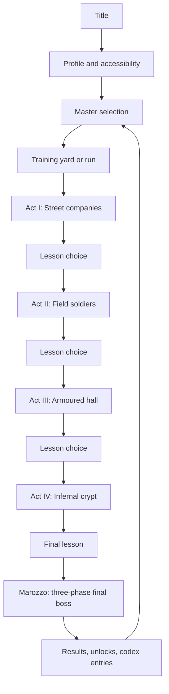

# Full game layout

## Product definition

**The Infernal Fechtschule** is a mobile-first 2.5D historical-fantasy arena brawler for solo and two-player co-op. Historical fencing masters walk a corrupted road through Renaissance Europe and into Italy — through streets, gatehouses, fencing halls, castles, and the infernal places beneath them. Each master carries two complementary weapon kits. Players use a common five-action grammar to perform character-specific routes, survive escalating enemy companies, choose temporary lessons, and break the infernal chains that bind the road.

The design aims for a complete run of roughly 25–35 minutes once content is mature. A shorter ten-minute “single stage” mode reuses the same encounters for mobile sessions.

## Design pillars

### 1. Historical identity through behavior

A fighter’s source tradition should influence timing, favored distance, guard interactions, and combo logic. Costume and move names support that identity; they do not carry it alone.

### 2. Two weapons, one coherent fighter

Each kit solves different problems. Switching is a tactical branch inside combos, not an inventory screen. Shared doctrine and movement keep the fighter coherent.

### 3. Hordes governed by fencing readability

Large groups create pressure, while attack permissions, clear preparation, spacing roles, and depth lanes prevent unavoidable overlap.

### 4. Short inputs, deep routes

Light, heavy, mobility, guard, and switch remain consistent across the roster. Mastery comes from timing, branching, target selection, and weapon transitions rather than long command lists.

### 5. The road becomes infernal

The run begins in grounded human settings — streets, gates, halls — and gradually enters crypt geometry, chained creatures, impossible weapons, and demonic bosses beneath castles. The fiction clearly separates historical source material from invention.

## Player journey

## Standard run structure

The sequence below is a production target, not a commitment to exact enemy counts.

| Act | Setting and enemy tier | Encounter pattern | Mechanical lesson | Major opponent |
|---|---|---|---|---|
| Prologue | Fencing school courtyard | Calibration + sparring | Controls, range, switching | Training master or animated plate |
| I — The Broken School | Streets, yards, tavern court | 3 waves + elite | Crowd shaping and broad attacks | Gang captain |
| II — The Field Company | Camp, bridge, earthwork | 3 waves + elite | Reach, formation gaps, depth movement | Sergeant or standard bearer |
| III — The Armoured Hall | Gatehouse, hall, tournament yard | 3 waves + elite | Guard pressure, armor openings, counters | Knight champion |
| IV — The Infernal Crypt | Catacombs, cursed keeps, impossible architecture | 3 waves + demon | Hazards, unusual movement, mixed threats | Greater grotesque |
| Finale | Marozzo’s infernal sanctum | 3 boss phases | Complete build and doctrine mastery | Achille Marozzo / the chains |

A lesson follows each act’s major encounter. The complete run therefore gives four build decisions before the final fight. Optional challenge rooms can offer risk/reward lessons, healing, codex fragments, or score multipliers.

## Final boss: Marozzo and the chains

The final encounter is fictional. It should avoid claiming that the historical Marozzo literally summoned demons.

### Phase I — The Master

- Sword-and-buckler defense
- Strong parry and counter behavior
- Clear human scale and grounded arena
- Tests guard manipulation and lateral approaches

### Phase II — The Arsenal

- Changes weapon configuration
- Calls earlier human elite roles into the arena
- Tears sections of the environment into printed geometry
- Tests target priority and weapon switching

### Phase III — The Last Chain

- The infernal force becomes visibly separate from the man as torn chains hang about the arena
- Marginal grotesques animate around the arena
- Area hazards rewrite safe depth lanes
- The player can break the final chain after a doctrine sequence

The ending can preserve ambiguity: Marozzo may be antagonist, guardian, prisoner, or avatar. This supports replayable character perspectives and avoids a simplistic historical villain portrayal.

## Roster model

Launch target: **six masters / twelve weapon kits**. Every assignment remains provisional until source review and gameplay testing.

| Candidate master | Kit A | Kit B | Proposed gameplay identity |
|---|---|---|---|
| Joachim Meyer | Longsword | Dussack | Provoke, take, hit; broad control into decisive openings |
| Giovanni dall’Agocchie | Sidesword | Sidesword and cape | Measured tempo, line closure, deceptive defense |
| Fiore dei Liberi | Longsword | Spear | Position, entries, throws or close control after weapon contact |
| Salvator Fabris | Single rapier | Rapier and dagger | Long measure, evasive body positions, precise counters |
| George Silver | Short sword/backsword | Staff or sword companion kit | Direct pressure, strong defense, compact committed actions |
| Achille Marozzo | Sword and buckler | Two-handed sword | Defensive layers, arsenal transitions, boss-to-unlockable arc |

These are candidate mechanical assignments rather than historical claims. A research sheet must document primary evidence, scholarly interpretation, adaptation, and invention before a kit is finalized.

### Roster construction rules

Each master requires:

- One shared doctrine or personal rule
- Two contrasting weapon roles
- One three-step light route per weapon
- At least two light/heavy branches per weapon
- Dodge-light and jump-light per weapon
- Parry-heavy counter per weapon
- Switch-entry attack in each direction
- One kit-specific crowd answer
- One kit-specific elite/armor answer
- Six to ten lessons, including cross-kit lessons
- Clear strengths, weaknesses, and co-op contribution

## Shared action grammar

| Action | Neutral use | Contextual use |
|---|---|---|
| Light | Fast starter | Continue or redirect a route |
| Heavy | Committed attack | Finisher, guard pressure, doctrine payoff |
| Mobility | Jump when neutral | Directional dodge; route-specific displacement |
| Guard | Hold block | Timed parry; cancel or counter where allowed |
| Switch | Change kit | Hit-confirmed entry, route branch, tactical reset |

Commands should normally contain two to four decisions. No motion inputs are required. The input buffer should tolerate touch timing and network delay without executing long accidental strings.

## Enemy ecosystem

### Thugs: teach crowd control

- Club rusher
- Knife flanker
- Grappler or restrainer
- Stone/throwing nuisance
- Gang captain

### Soldiers: teach formation and distance

- Spear line
- Sword-and-shield holder
- Halberd sweeper
- Crossbow telegraph threat
- Standard bearer who coordinates attack permissions

### Knights: teach openings

- Armoured sword fighter
- Poleaxe elite
- Shielded champion
- Mounted or dismounted set-piece threat, only if readable in the arena format

### Demons: test mastered rules

- Wretch swarm
- Chained leaper
- Crypt ambusher
- Weapon-eating grotesque
- Greater bound creature

Every enemy requires a primary purpose, readable preparation, punish window, crowd role, and co-op behavior. Enemy health alone must not define a tier.

## Director and attack permissions

The encounter director separates **presence** from **permission to attack**.

Per player, a baseline budget allows approximately:

- Two ordinary melee commitments
- One reach or ranged preparation
- One boss action that can temporarily supersede ordinary permissions

Other enemies move, threaten, circle, recover, or seek lanes. The budget can rise in challenge modes, but ordinary campaign difficulty should avoid simultaneous unavoidable timings.

The director also:

- Splits pressure between co-op players
- Detects separation and prevents off-screen pileups
- Protects revive opportunities without making them automatic
- Reserves spawn lanes away from immediate player attacks
- Increases complexity by combining roles rather than multiplying health

## Run progression

### Temporary lessons

Lessons alter moves, routes, defensive windows, switch behavior, collisions, or crowd effects. Four choices during a standard run should create a recognizable build without producing an unreadable skill tree.

Offer structure:

- One Kit A lesson
- One Kit B lesson
- One shared/doctrine lesson

Later difficulty tiers can add rare lessons and mutually exclusive capstones.

### Permanent progression

Recommended permanent rewards:

- New masters
- Alternate lesson pools
- Costumes and palette treatments
- Training scenarios
- Codex entries and source notes
- Challenge modifiers
- Music and gallery material

Avoid permanent health or damage bonuses in the principal mode. Mechanical power accumulation would blur the intended skill curve and co-op balance.

## Modes

### Chronicle run

The complete 25–35 minute progression culminating in Marozzo.

### Single stage

A ten-minute mobile run: one tier, one lesson, one boss.

### Training hall

Frame/state display, recordable dummy behavior, combo list, parry timing, weapon comparison, and optional slow motion.

### Two-player co-op

Each player uses a separate phone or desktop client. Shared encounter, separate health/guard, individual lesson choices in the long-term design, and a limited revive system.

### Challenges

Authored rule sets such as no guarding, fixed weapon, armored enemies only, score attack, or boss practice.

### Codex

Clearly separated panels for documented source material, adaptation notes, and invented story. Citations and image licenses are first-class content.

## Co-op design

- Two players is the production baseline.
- Each player owns a distinct fighter; duplicate selection remains available for testing.
- Enemy health scales modestly; complexity primarily scales through count, role combinations, and attack permissions.
- Friendly collision is soft and never causes damage.
- Friendly attacks do not interrupt partners in the standard mode.
- A downed player can be revived by a nearby partner holding Guard, subject to interruption.
- Camera logic keeps both players legible; strong separation triggers a visible tether warning before hard constraints.
- Lesson selection eventually becomes individual. Shared run modifiers remain a separate category.

## Screen and HUD layout

### Title and setup

- Primary action: continue/start
- Secondary: co-op, training, codex, settings
- Motion permission is requested only from an explicit user action
- First launch includes a short calibration trial rather than a text wall

### Master selection

- Full-body silhouette and both weapon kits
- Three concise identity statements
- Input route preview
- Historical/invented-content label access
- Co-op partner status without obscuring selection

### Gameplay HUD

- Upper left: health, guard, current weapon, doctrine state
- Upper center: encounter title and transient objective
- Upper right: score, challenge state, pause
- Boss bar: only during boss encounters
- Lower corners: touch movement and action controls
- Center: reserved for silhouettes, telegraphs, and transient hit feedback

### Lesson screen

- Three large cards
- Each card states the exact behavioral change
- Before/after route preview where possible
- No generic “+5% damage” language
- Co-op readiness visible but secondary

### Results

- Run time, score, damage taken, parries, weapon usage, discovered routes
- New codex/unlock notices
- Replay, change master, and return-to-title actions
- Optional local export of a playtest report

## Content budget target

A realistic first commercial/content-complete target:

- 6 masters
- 12 weapon kits
- 5 act themes including prologue/finale
- 14–18 ordinary enemy archetypes
- 5 act elites or mini-bosses
- 5–7 major bosses including Marozzo
- 50–70 lessons across the roster
- 12–18 challenge scenarios
- One complete codex entry per master and weapon kit
- Solo and two-player co-op

The roster should expand only after one complete character pipeline demonstrates acceptable cost for animation, hit data, effects, audio, source review, and balance.
