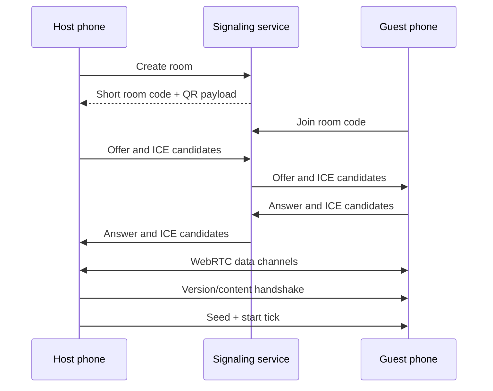

# Networking plan

## Scope decision

Browser-to-browser Bluetooth is outside the web release scope. The practical mobile path is WebRTC over Wi-Fi, a phone hotspot, or the internet. Native Bluetooth could be explored only through a separately maintained native wrapper and should not shape the browser architecture.

## Vertical-slice implementation

The included **Two-phone Co-op Lab** uses manual WebRTC signaling:

- Host creates an SDP invitation token.
- Guest pastes it and creates an answer token.
- Host pastes the answer.
- Gameplay traffic moves through WebRTC data channels after connection.

Advantages:

- GitHub Pages remains the only host for the game files.
- No account, database, or signaling service is required for early tests.
- The networking protocol can be exercised before backend work.

Limitations:

- Token exchange is cumbersome on phones.
- Some NAT/firewall combinations require a TURN relay.
- The slice uses a public STUN configuration and has no relay credentials.
- A browser or managed network can restrict WebRTC UDP traffic.
- The guest currently renders authoritative snapshots without complete prediction/reconciliation.
- Host migration is absent.

## Authority model

The host is the source of truth for:

- Random seed
- Players’ accepted inputs
- Enemy AI
- Attack permissions
- Hit, guard, parry, armor, and death results
- Wave progression
- Lesson choice
- Score, victory, and defeat

The guest is authoritative only for its immediate physical input sample. It never tells the host that a hit occurred.

## Channel semantics

Production should use two data channels.

### Realtime channel

Unordered and configured for low or zero retransmission:

- Movement axes
- Replaceable input state
- Replaceable snapshots
- Aim/facing intent if added

Dropping one of these packets is preferable to receiving it late.

### Reliable channel

Ordered and reliable:

- Join/start
- Lesson choices
- Wave transitions
- Pause/restart votes
- Player-down/revive confirmation
- Protocol errors
- Content/hash negotiation

## Production connection flow

The signaling service relays only connection metadata. Gameplay should remain peer-to-peer unless a relay is required.

## Signaling service requirements

A small production service needs:

- Six-character room codes or QR payloads
- Short room lifetime, e.g. ten minutes before connection
- WebSocket or server-sent candidate exchange
- No durable personal data
- Rate limiting and abuse controls
- Origin allowlist for the deployed game
- Health metrics and structured errors
- Region strategy appropriate to the expected audience
- TURN credentials issued with short lifetime

Suitable deployment choices include a small WebSocket service or an edge worker with a stateful room primitive. Keep it in a separate deployable unit because GitHub Pages is static hosting.

## Simulation and replication target

- Fixed simulation: 60 Hz on host
- Guest input: 30 Hz plus immediate edge/button changes
- Host snapshots: 15–20 Hz
- Rendering: device refresh rate
- Remote interpolation buffer: approximately 80–120 ms, tuned through tests
- Local movement prediction: immediate
- Local attack animation prediction: immediate after valid local input
- Hits and damage: host-confirmed
- Short host rewind for parry/dodge validation: bounded and timestamped

Exact rates must be profiled. The numbers above are starting points rather than protocol guarantees.

## Defensive timing under latency

Parries and dodges are unusually sensitive to delay. Production should:

1. Timestamp input against a synchronized session clock.
2. Keep a short host history of attack states and positions.
3. Evaluate defensive input against the bounded historical state.
4. Clamp rewind to prevent extreme latency from producing implausible results.
5. Show predicted feedback immediately, then correct only when host disagreement is material.
6. Collect local diagnostic logs for RTT, jitter, loss, rewind amount, and correction distance.

Do not make the guest’s reported parry outcome authoritative.

## Reconciliation priorities

Correction hierarchy:

1. Health, guard, death, wave state, and lesson state: always authoritative immediately.
2. Player movement: smooth small errors; snap only beyond a defined safety threshold.
3. Remote enemies: interpolate between snapshots.
4. Particles, floating numbers, sound, and camera feedback: event-driven and disposable.
5. Predicted attack animation: continue where possible; cancel only when the host rejects the action.

## Co-op upgrade choice

The slice uses a shared host choice. Full-game target:

- Each player chooses one personal lesson independently.
- The host validates that both choices belong to the current offer.
- The run continues when both players lock in or a timeout applies a safe default.
- Shared encounter modifiers appear as a separate unanimous vote.

## Reconnect and host loss

Recommended order:

1. Support short guest reconnect to the same host using a session token.
2. Preserve the current wave and character state on host for a limited grace period.
3. Allow the host to continue solo if the guest disconnects.
4. Add host migration only after ordinary reconnect is reliable; migration requires peer state checks, deterministic input history, and authority transfer.

Host migration is costly and should not block an initial co-op release.

## Compatibility handshake

Before starting, peers exchange:

- Protocol version
- Build version
- Content manifest hash
- Simulation schema version
- Supported feature flags
- Preferred snapshot compression

Mismatched simulation/content builds must refuse the session with an explicit message rather than attempting an unsafe connection.

## Privacy and security

- Collect no contact list, Bluetooth, or location data.
- Motion input stays local except for normalized movement axes sent as gameplay input.
- Room metadata expires quickly.
- Do not place permanent credentials in the GitHub Pages bundle.
- TURN credentials must be ephemeral.
- Treat every received message as untrusted: validate type, size, range, sequence, and allowed phase.
- Cap token and message sizes to prevent memory abuse.
- Display connection quality without exposing raw IP information.

## Network acceptance tests

- Same Wi-Fi, separate iOS/Android phones
- Phone hotspot in each direction
- Wi-Fi with 50/100/150 ms artificial latency
- 1/3/5% packet loss
- Jitter bursts
- Tab background/resume
- Screen lock interruption
- Guest reconnect during an ordinary wave
- Host continuation after guest loss
- Protocol-version mismatch
- TURN-relayed connection

Success criterion for the first production co-op milestone: three consecutive complete vertical-slice runs per test configuration without a session-ending desynchronization, with median local correction below the visually detectable threshold established in playtests.
