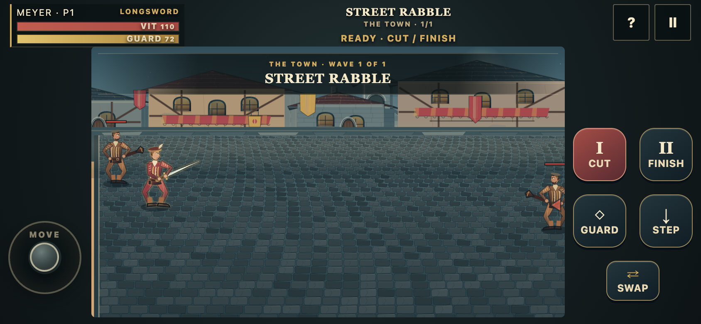
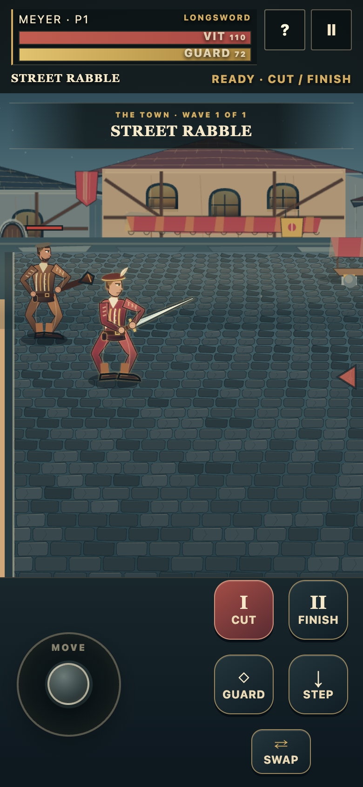

# Procedural edition validation

**Date:** 17 September 2026. **Edition:** 0.2.0. **Base:** `fc6588fe85a0785ad1f005c52b51e98daaf1d137`.

Implementation and browser execution used the connected Mac through Remote Desktop Commander. The test environment was macOS 14.6, Node v25.6.1, and installed Google Chrome 153.0.8010.47. Browser tests used Playwright 1.63.0. Both headed and headless Chrome sessions were exercised.

## Results

| Check group | Result | Scope |
|---|---:|---|
| Unit / simulation / input / packaging | **151 / 151 passed** | Combat states, command windows, adjacent physical edges, items, AI, deterministic campaign flow, pointer ownership, viewport rig geometry, cache integrity, and preview safety. |
| Live Chrome phone/UI checks | **65 / 65 passed** | Desktop plus five emulated phone sizes; actual multi-touch, overlap/field obstruction, hit-target ownership, scale, portrait height, guide pause/resume, input release, and no raster-art requests. |
| Live browser combat audit | **35 / 35 passed** | Both weapons and facings, all directional guard commands, fast Cut links, expiry, hold suppression, parry answers, Step/Cut, heavy commitment, focus loss, and a render stress fixture. |
| Offline / peer audit | **7 / 7 passed** | Cold offline reload after caching, cache contents, manual WebRTC pairing, two-player snapshots, and guest input reaching the authoritative host. |
| Headed live play / restart | **4 / 4 passed** | Normal physical keyboard input, finite state, restart to the live clock, and no browser exceptions. |
| Scenery captures | **4 distinct frames; 0 exceptions** | Actual procedural renderer in four authored setting/equipment fixtures. |

The machine-readable [summary](evidence/summary.json) and per-suite JSON reports are checked in. These groups overlap in coverage and are not summed into a claim of that many independent requirements.

## Phone coverage

Emulated sizes: **844×390, 667×375, 932×430, 390×844, and 360×740**, with touch enabled and device scale factor 2. Desktop coverage used 1440×900. Chrome DevTools Protocol delivered simultaneous stick and Cut touch contacts, rather than replacing touch with keyboard-only tests.

The primary actions are 64×64 CSS pixels; Swap is 64×48. Checks verified distinct non-overlapping hit regions, correct element ownership at button centers, no controls over the fighting field, no horizontal page overflow, uniform canvas scaling, and at least 320 CSS pixels of portrait field height. Lifecycle regressions cover blur, pointer cancellation, rotation/reset, and text-field isolation.

## Payload and runtime measurements

The build's precache list fell from **974 entries / 22,811,596 bytes** to **30 entries / 487,123 bytes**, excluding the duplicate root-document alias in both byte totals. The actual populated new browser cache contained **500,871 bytes** including that alias. Runtime requests for sprite/background bitmaps: **zero**. The build identifier is `infernal-fechtschule-0.2.0-681d94d034`.

The final normal live-play sample lasted **30.058 seconds**. Across its captured frame intervals, the median was **16.66 ms**, the 95th percentile **17.46 ms**, and none exceeded 50 ms. This is a measurement on this Mac in that scene, **not a physical-phone performance guarantee**. The separate 17-actor stress fixture and its full timing distribution are in `evidence/combat.json`.

## Review and screenshot evidence

Three separate read-only review sessions examined the baseline, the first visual/mobile candidate, and the revised combat code. They identified defects that a green first test run had missed. See [review resolutions](PROCEDURAL_REWORK.md) and the reports under `docs/reviews/`. No independent final historical or physical-device sign-off is implied.

Additional captures show the [previous phone view](evidence/before-phone.png), [title](evidence/title-desktop.png), [normal live combat](evidence/live-combat.png), and authored [street](evidence/cobbled-streets.png), [gate](evidence/town-gate.png), [fencing hall](evidence/sala-darmi.png), and [castle](evidence/castello.png) fixtures. Fixture screenshots are labelled as such; they are not presented as evidence of a human campaign playthrough.

## Explicit limitations

**Safari/WebKit:** a Playwright WebKit installation was downloaded, but the browser did not complete launch. The stalled test processes were terminated. No WebKit/Safari checks passed or were counted.

**Physical phones:** none were available through the connection. iPhone Safari, Android hardware performance, thermals, battery use, motion permissions, and two-device co-op remain unverified.

**Historical fidelity:** the code reviewers were software reviewers. No specialist HEMA review or source-by-source pose reconstruction was completed. The game identifies its fencing as arcade adaptation.

**Visual judgment:** procedural illustration and LF2-like feel have a subjective component. Passing geometry, input, and performance checks does not establish photorealism, exact historical movement, or equivalence to LF2. The screenshots show the implemented art direction.

**CI/public deployment:** these results describe the connected-Mac working tree and included compiled build. They do not claim an unobserved GitHub Actions result or deployment of this branch to the main Pages site.
